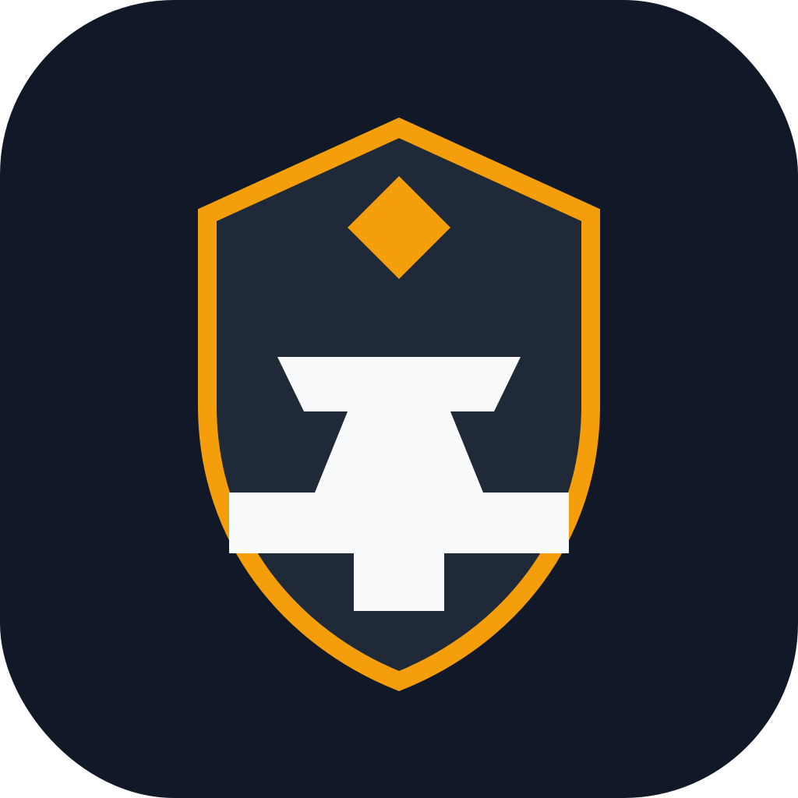

<p align="center">
  
</p>

# interview-forge

A stateful mock interview system that turns interviews, drills, flashcards, reports, and rewards into one continuous learning loop.

## Why it's different

Most interview apps stop at asking questions. `interview-forge` keeps the whole study loop connected.

- **Built for pressure, not just passive familiarity** — reading, watching, and recognizing concepts can create the illusion of understanding, but real interviews demand fast recall, structured thinking, and clear communication under stress.
- **Stateful, not just conversational** — the interview flow is enforced by MCP tools and a strict session state machine, so the session never drifts out of sync.
- **Built for repeated learning, not one-off practice** — weak answers feed the next cycle through drills, flashcards, reports, and graph updates.
- **Tracks how your understanding evolves** — completed sessions merge into a cumulative knowledge graph instead of disappearing into chat history.
- **Designed to keep you engaged** — a lightweight rewards loop uses small wins, visible momentum, and reinforcement patterns inspired by games and neuroscience.

## Quick start

```bash
git clone https://github.com/eliasjunior/interview-forge.git
cd interview-forge
npm install
cp interview-mcp/.env.example interview-mcp/.env
npm run dev:http
```

In a second terminal:

```bash
npm run dev:ui
```

Then open:

- `http://localhost:5173`
- `http://localhost:5173/graph`
- `http://localhost:5173/flashcards`

Full setup, MCP connection, and troubleshooting: [Getting started](docs/getting-started.md)

## First run

The easiest way to understand the project is:

1. Start the API and UI.
2. Open the dashboard in the browser.
3. In Claude Desktop or Claude Code, try:

```text
I want to study JWT authentication
```

Claude can then route you into the warm-up ladder, a full interview, or a drill based on your topic history.

## Custom Content Flow

You can also start a scoped interview directly from the UI when you have your own problem statement or spec.

1. Open `http://localhost:5173/topics`.
2. Click `Start With Content`.
3. Enter a topic, optional focus, and paste the content.
4. Create the session. The backend normalizes the content into scoped interview context before saving it.
5. Open the created session and use `Start In Claude` or `Copy prompt`.
6. Paste that prompt into Claude Desktop. Claude should call `get_session` first and continue from the current state.

This is the current recommended path for algorithm-style interviews that are not yet first-class `interviewType: "code"` topics in the knowledge base.

## What you can do

1. **Conduct interviews** — Claude picks questions from curated knowledge files, or generates them with AI when enabled, asks them one at a time, follows up, and enforces a strict state machine so the session never gets out of sync.
2. **Evaluate answers** — after each answer, the server scores it, writes detailed feedback, and surfaces a stronger model answer. Scoring can be done by a worker LLM or by the orchestrator Claude itself.
3. **Build a knowledge graph** — every completed session extracts concepts and merges them into a growing graph with canonicalized concepts, weighted co-occurrence edges, and semantic relationships.
4. **Generate flashcards** — weak answers automatically become spaced-repetition flashcards scheduled with SM-2.
5. **Produce reports** — each session generates a Markdown report and an interactive HTML viewer.
6. **Visualise progress** — the React dashboard shows session history, reports, the D3 knowledge graph, and flashcard review.
7. **Add a rewards loop** — the learning experience is designed to feel more engaging and motivating, using lightweight ideas from games and neuroscience to reinforce progress.

## Flashcard Evaluation Loop

Flashcard review has a second loop beyond SM-2 scheduling:

1. The learner answers a flashcard in the UI.
2. The answer is stored in `flashcard_answers` with state `Pending`.
3. Claude runs `evaluate_flashcard`, which claims `Pending` answers and marks them `Evaluating`.
4. Claude must then call `save_flashcard_evaluation` once per returned answer.
5. On `needs_improvement`, the old card is archived, a stronger replacement card is created, lineage is linked with `parentFlashcardId` / `replacedByFlashcardId`, and a mistake is logged.

Important:
- `evaluate_flashcard` alone does not finish the workflow.
- Any automation or scheduled job that runs `evaluate_flashcard` must also run `save_flashcard_evaluation` for each answer it receives.
- If that second step is skipped, no flashcard improvement history is saved.

## Docs

- [Getting started](docs/getting-started.md)
- [Usage](docs/usage.md)
- [Architecture](docs/architecture.md)
- [Tools and API reference](docs/tools.md)
- [Topics and content](docs/topics-and-content.md)
- [Learning loop](docs/learning-loop.md)
- [Development](docs/development.md)

## Monorepo at a glance

```text
interview-forge/
├── interview-mcp/   MCP server — interview state machine, data owner, REST API
├── report-mcp/      MCP server — analytics, report generation, knowledge graph queries
├── ui/              React + Vite dashboard
└── shared/          Shared TypeScript types
```

## Development

Useful starting points:

- [Development guide](docs/development.md)
- [interview-mcp README](interview-mcp/README.md)
- [report-mcp README](report-mcp/README.md)
